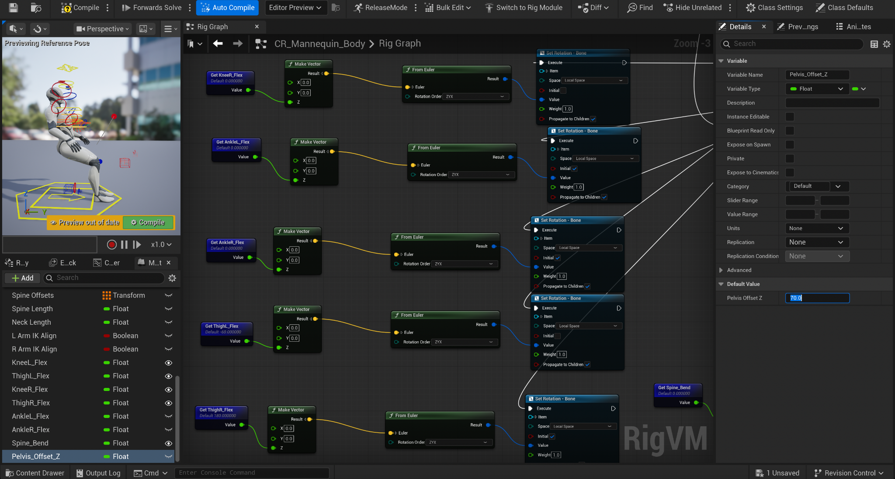

# Unreal Engine Virtual Workplace & Skeletal Avatar Framework

**Research Project | Binghamton University | January 2025 – August 2026**

**Role:** Undergraduate Research Assistant  
**Research Advisor:** Prof. Yu Chen  
**Engine:** Unreal Engine 5.6.1  
**Technologies:** Unreal Engine, Blueprints, Control Rig, Skeletal Animation, 3D Environment Design

## Project Overview

This project focused on developing a virtual workplace environment to support research on replay-attack detection using Environmental Network Frequency (ENF) fingerprints and virtual-physical synchronization.

My primary contribution was creating a virtual environment in Unreal Engine and implementing a controllable skeletal avatar framework. The environment was designed to provide a foundation for future integration of human detection and position tracking.

## My Contributions

### 1. Virtual Environment Development

- Recreated the layout of a real-world room in Unreal Engine, including walls, furniture, and interior objects.
- Configured a 3D environment containing a skeletal humanoid avatar.
- Organized environmental assets to support further development of the virtual workplace.

### 2. Skeletal Avatar and Joint Control

Configured a humanoid skeletal avatar using Unreal Engine's Blueprint-based Control Rig system.

Developed parameter-driven controls for individual body joints, including:

- Left and right knee flexion
- Left and right thigh rotation
- Left and right ankle flexion
- Spine bending
- Vertical pelvis adjustment

These controls form a foundation for configuring full-body poses and avatar movements.

### 3. Blueprint and Control Rig Implementation

**Joint Rotation Control**

Implemented a node-based control pipeline that converts joint parameters into bone rotations:

`Joint Parameter → Make Vector → From Euler → Set Rotation - Bone`

This approach allows joint movements to be adjusted through configurable parameters rather than relying exclusively on predefined animation sequences.

**Spine and Pelvis Control**

Implemented separate controls for upper-body rotation and pelvis translation:

- `Spine_Bend` controls spinal rotation.
- `Pelvis_Offset_Z` controls vertical pelvis positioning.

The Rig Graph uses rotation and translation nodes to support configurable postures.

## Pose Demonstration

To validate the Control Rig setup, I adjusted exposed parameters such as `Pelvis_Offset_Z`, knee flexion, and thigh rotation to produce different avatar postures.  
The screenshot below shows a seated-style pose generated through parameter-based pose manipulation inside Unreal Engine.

## Research Context

The broader research investigates ENF-based replay-attack detection and the relationship between virtual and physical environments.

My work focused on the Unreal Engine environment and avatar framework rather than implementing the ENF detection algorithm itself.

## Future Work

The virtual environment was developed to support subsequent research efforts, including:

- YOLO-based human detection
- Human position tracking
- Integration of tracked movement into the virtual workplace
- Further virtual-physical synchronization research

**Note:** YOLO-based detection and position tracking were planned as future extensions and were not implemented as part of my contribution.

## Project Scope

This repository documents my contributions to the Unreal Engine virtual environment and avatar control framework. The screenshots demonstrate the environment and Control Rig implementation.

The complete Unreal Engine project and any third-party assets are subject to research-sharing permissions and applicable asset licenses.

## Acknowledgments

This project was conducted under the supervision of Professor Yu Chen at Binghamton University as part of the Intelligent and Sustainable Edge Computing (I-SEC) research group.