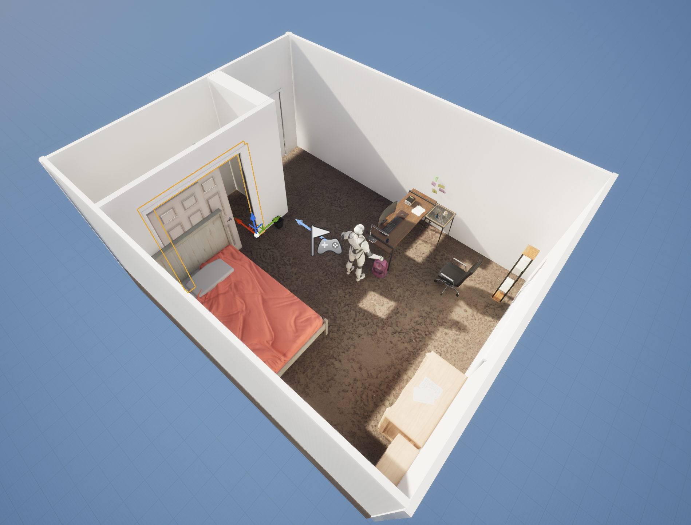
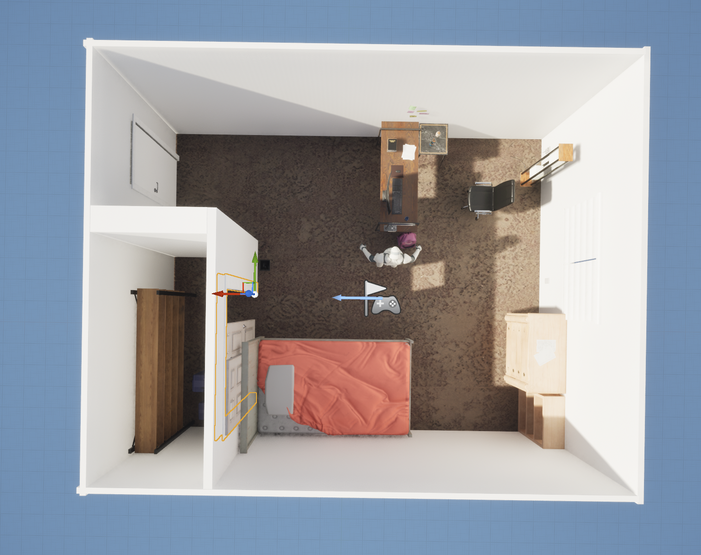
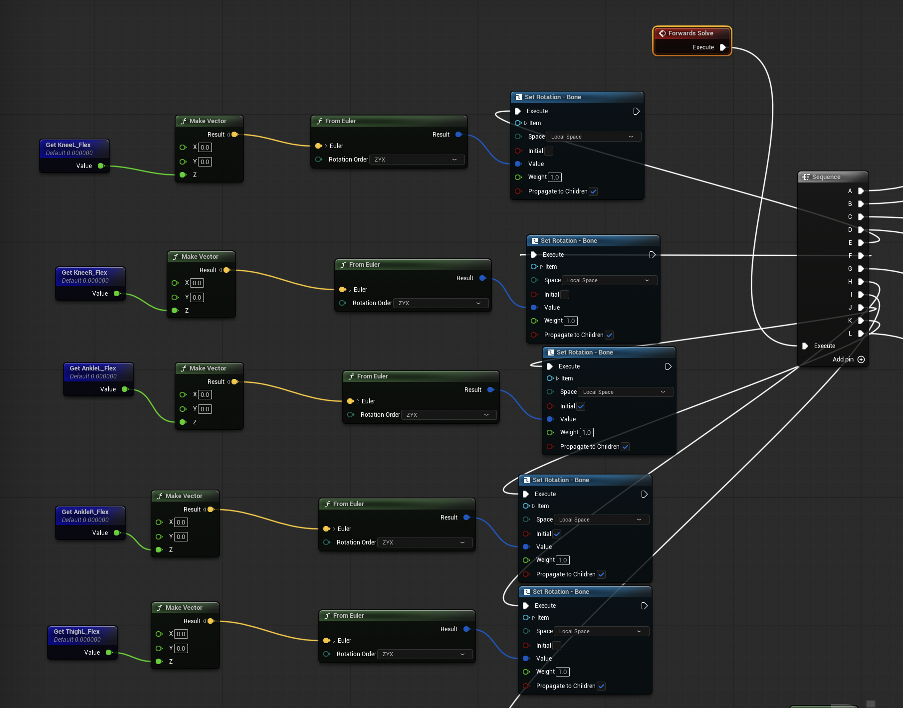
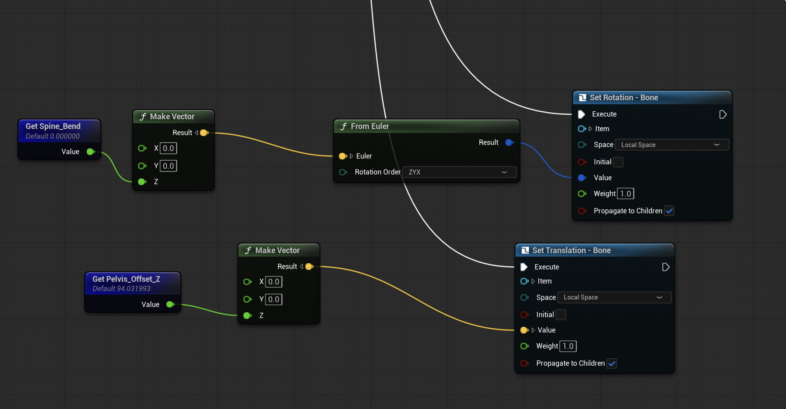

# Virtual Workplace & Skeletal Avatar Control | Unreal Engine 5

**An Unreal Engine research prototype for virtual workplace modeling and parameter-driven humanoid pose control.**

**My role:** Research Assistant, Intelligent and Sustainable Edge Computing (I-SEC), Binghamton University  
**Advisor:** Prof. Yu Chen  
**Research period:** January 2025 – August 2026  
**Engine used:** Unreal Engine 5.6.1  
**Tools:** Unreal Engine, Blueprint visual scripting, Control Rig, skeletal meshes, 3D level editing



## The research goal

The broader research investigates **replay-attack detection using environmental network frequency (ENF) fingerprints** and synchronization between physical and virtual workplaces. A usable virtual workplace needs a modeled space and a controllable representation of a person before future sensing, detection, and tracking components can be integrated.

**My assignment was to build that Unreal Engine foundation:** a virtual room based on a real space, populated with environmental objects and a skeletal avatar whose body pose can be adjusted through parameters.

> **Scope clarification:** This repository documents the *virtual environment and avatar control work*. I did **not** implement the ENF replay-attack detection algorithm or YOLO-based human detection/tracking.

## What I built

### 1. Virtual room environment

- Recreated a real-world room layout in Unreal Engine and arranged walls, furniture, and other scene objects.
- Placed a humanoid skeletal avatar in the scene to provide a controllable human representation.
- Prepared the scene as an initial environment for later virtual–physical synchronization research.

| Perspective view | Top-down view |
|---|---|
|  |  |

### 2. Parameter-driven skeletal avatar controls

I configured a **Control Rig graph** with editable parameters for body joints rather than depending only on fixed animation clips. The visible graph includes parameters for:

| Control parameter | Intended adjustment |
|---|---|
| `KneeL_Flex`, `KneeR_Flex` | Left and right knee flexion |
| `ThighL_Flex`, `ThighR_Flex` | Left and right thigh rotation |
| `AnkleL_Flex`, `AnkleR_Flex` | Left and right ankle flexion |
| `Spine_Bend` | Torso/spine bending |
| `Pelvis_Offset_Z` | Vertical pelvis translation |

These are **rig controls**, not an automated motion-capture or vision-based tracking system.

### 3. How the Control Rig works

**Joint rotation pipeline**

```text
Editable joint parameter
    -> Make Vector
    -> From Euler
    -> Set Rotation - Bone
```

In the graph, a joint parameter supplies a rotation value. `Make Vector` builds a three-component input, `From Euler` converts Euler-angle inputs into a rotation representation, and `Set Rotation - Bone` applies that rotation to the targeted skeletal bone. Separate controls make individual joint pose adjustments possible.



**Spine bending and pelvis positioning**

```text
Spine_Bend       -> Make Vector -> From Euler -> Set Rotation - Bone
Pelvis_Offset_Z  -> Make Vector               -> Set Translation - Bone
```

The spine control modifies bone orientation, while the pelvis control changes the vertical position of a bone. Combining rotation and translation controls provides a basis for configuring different avatar postures, including standing, bending, and seated-pose development.



## Engineering takeaways

- **Scene construction:** translated a physical room layout into a navigable 3D workspace.
- **Skeletal representation:** worked with bones, skeletal meshes, and rig controls instead of manipulating an avatar as a single rigid object.
- **Visual programming:** expressed adjustable joint behavior as a connected Control Rig/Blueprint node graph.
- **System boundaries:** built a reusable virtual-world component intended to interface with, but distinct from, future perception and security-detection systems.

## Current results and limitations

**Demonstrated here:** Unreal Engine room scene, skeletal avatar placement, and node graphs for joint rotation and pelvis translation.

**Not demonstrated or claimed:** quantitative tracking accuracy, real-time YOLO integration, replay-attack detection results, or a complete end-to-end virtual–physical synchronization pipeline.

## Future research directions (not implemented in my contribution)

The research team may extend this environment with:

- YOLO-based human detection;
- position tracking and coordinate mapping into the virtual scene;
- virtual–physical state synchronization;
- integration with the broader ENF-based security research workflow.

## Project files and reuse

This portfolio currently contains **documentation and screenshots**, not the complete Unreal Engine source project. The full project includes third-party environment assets, so redistributing its asset files requires review of research-sharing permissions and applicable licenses. The complete research handoff is handled separately.

## Acknowledgments

Developed during my Research Assistant appointment under **Prof. Yu Chen**, Intelligent and Sustainable Edge Computing (I-SEC), Binghamton University.
